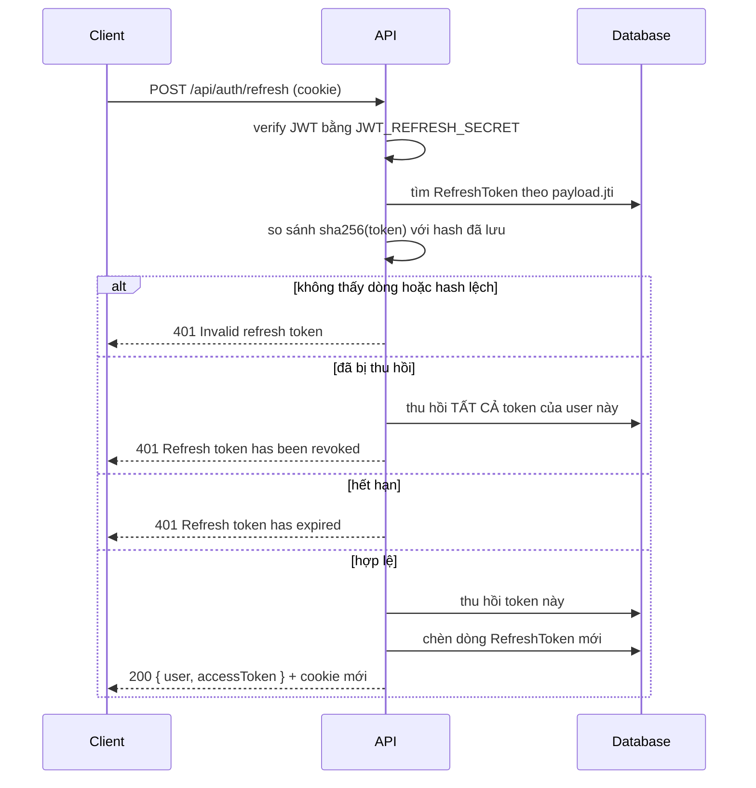

# Xác thực

[← Mục lục tài liệu](../README.md)

Hai loại token với vòng đời, nơi lưu trữ và mô hình rủi ro khác nhau.

| | Access token | Refresh token |
| --- | --- | --- |
| Secret | `JWT_SECRET` | `JWT_REFRESH_SECRET` |
| Thời hạn | `JWT_ACCESS_EXPIRES_IN` (mặc định `15m`) | `JWT_REFRESH_EXPIRES_IN` (mặc định `7d`) |
| Payload | `{ sub, email }` | `{ sub, jti }` |
| Trả về qua | Body JSON của response | Cookie httpOnly |
| Client lưu ở | **Chỉ trong bộ nhớ** | Cookie jar của trình duyệt (JS không đọc được) |
| Server lưu ở | Không lưu | Hash SHA-256 trong bảng `RefreshToken` |
| Gửi kèm khi | Mọi request, `Authorization: Bearer …` | Chỉ `/api/auth/*` (do path của cookie) |

Hai secret phải khác nhau. Cả hai đều được kiểm tra lúc khởi động là ≥ 16 ký tự.

## Cookie

Được set bởi `AuthController.respondWithTokens`:

| Thuộc tính | Giá trị |
| --- | --- |
| Tên | `refreshToken` |
| `httpOnly` | `true` |
| `sameSite` | `lax` |
| `path` | `/api/auth` |
| `secure` | `true` chỉ khi `NODE_ENV=production` |
| `expires` | `exp` của token |

`path` hẹp có nghĩa refresh token không bị đính vào các lời gọi API thông thường —
nó chỉ đi tới đúng những endpoint auth cần nó.

## Phát hành token

`register` và `login` đều kết thúc ở `issueTokens`:

1. Ký access token bằng secret và thời hạn mặc định của module.
2. Sinh một `jti` (uuid), ký refresh token với `jwtid: jti`.
3. Decode token vừa ký để lấy `exp`, rồi lưu một dòng `RefreshToken` có
   **`id` chính là `jti`** và `tokenHash` là `sha256(token)`.
4. Trả `{ user, accessToken }` trong body; phần còn lại nằm ở cookie.

Vì `id` của dòng *chính là* `jti`, việc kiểm tra một token chỉ tốn một lần tra
khóa chính — không quét bảng, không cần index trên bản thân token.

## Xoay vòng và phát hiện tái sử dụng



Mỗi lần refresh thành công đều **xoay vòng**: token vừa xuất trình bị thu hồi và
một cặp mới được phát hành. Xuất trình một token đã bị thu hồi được coi là dấu
hiệu bị đánh cắp — token đó đủ hợp lệ để đi tới bước này, nên hoặc nó bị replay,
hoặc bản sao của người dùng hợp lệ đã rò rỉ. Phản ứng là thu hồi **mọi** token
đang hoạt động của user đó, buộc đăng nhập lại ở tất cả nơi.

`logout` cố ý làm theo kiểu best-effort: token thiếu, sai định dạng hay đã bị thu
hồi đều không phải lỗi. Nó thu hồi được gì thì thu hồi và luôn trả `200`, nên
đăng xuất không bao giờ thất bại.

## Phía client

[`apps/web/src/lib/api.ts`](../../apps/web/src/lib/api.ts) gói toàn bộ luồng này
sau một axios instance duy nhất tạo với `withCredentials: true`.

- **Token nằm trong bộ nhớ.** `setAccessToken` giữ nó trong một biến ở cấp
  module. Một request interceptor đính `Authorization: Bearer …`. Không đụng tới
  `localStorage` hay `sessionStorage`, nên payload XSS không thể đọc token ra từ
  storage.
- **Refresh ngầm.** Response interceptor bắt `401`, đánh dấu request là
  `_retried`, gọi `/auth/refresh` rồi phát lại request gốc với token mới. Các
  request tới `/auth/login` và `/auth/refresh` được loại trừ để sai mật khẩu
  không kích hoạt vòng lặp refresh.
- **Mỗi lần chỉ một refresh.** Nhiều lỗi `401` đồng thời dùng chung một promise
  đang chạy (`refreshing`), nên mười request hỏng cùng lúc chỉ tạo ra một lời gọi
  refresh chứ không phải mười.
- **Đường thất bại.** Nếu refresh hỏng, `onAuthFailure` được kích hoạt.
  `AuthProvider` nối nó vào việc xóa store auth (Zustand), còn layout `(app)` sẽ
  chuyển hướng về `/login`.
- **Khôi phục phiên.** `AuthProvider` gọi `bootstrap()` khi mount, dùng cookie để
  lấy access token mới — đây là lý do reload trang vẫn giữ đăng nhập dù access
  token chỉ tồn tại trong bộ nhớ.

## Guard và người dùng hiện tại

`JwtAuthGuard` (Passport JWT) được gắn **theo từng controller**, không phải
global. `JwtStrategy` đặt một `AuthUser` lên `request.user`:

```ts
interface AuthUser { userId: string; email: string }
```

Controller đọc nó bằng decorator `@CurrentUser()` rồi truyền `user.userId` xuống
service. Service không bao giờ đọc request.

## Endpoint

Xem [Tham chiếu API Auth](../api/auth.md).

## Liên quan

- [Phân quyền](authorization.md) — người đã xác thực được phép làm gì
- [Cấu hình](../configuration.md) — các biến môi trường JWT
