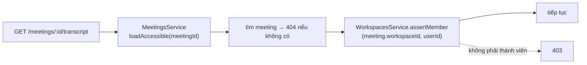

# Phân quyền

[← Mục lục tài liệu](../README.md)

Phân quyền gồm hai lớp kiểm tra độc lập: **bạn có ở trong workspace này không**,
và **role của bạn có cho phép hành động này không**. Hai lớp này ghép với nhau,
và một loại quy tắc thứ ba — quyền sở hữu tài nguyên — được từng service chồng
lên trên.

## 1. Membership

`WorkspacesService.assertMember(workspaceId, userId)` tra dòng `WorkspaceMember`
theo khóa kép `(workspaceId, userId)` và throw
`403 Not a member of this workspace` nếu không có. Khi thành công, nó trả về
chính dòng membership đó — vốn đã mang sẵn role — nên nơi gọi không cần truy vấn
lần hai.

Chủ sở hữu không được xử lý đặc biệt: tạo workspace cũng tạo luôn một dòng
membership `OWNER`, nên chủ sở hữu đi qua đúng lớp kiểm tra như mọi người.

Một biến thể không throw, `isMember`, dùng cho logic rẽ nhánh — cụ thể là để xác
nhận người được giao action item có thuộc workspace hay không.

### Quyền truy cập được thừa kế từ workspace

Không thứ gì nằm dưới meeting có danh sách quyền riêng. Transcript, summary,
action item và cả việc tải file đều tra ra meeting cha trước, rồi kiểm tra
membership của workspace chứa meeting đó:



`loadAccessible` là điểm nghẽn duy nhất. `ActionItemsService` đi tới nó gián
tiếp — nó nạp action item trước, rồi gọi `loadAccessible` với `meetingId` của
item.

## 2. Capability

Nơi gọi nêu tên một **hành động**, không bao giờ nêu role. Bảng role → hành động
là chỗ duy nhất cần sửa khi đổi quy tắc:
[`WorkspacePolicy`](../../apps/api/src/modules/workspaces/policies/workspace.policy.ts).

| Hành động | OWNER | ADMIN | MEMBER |
| --- | :---: | :---: | :---: |
| `workspace:update` | ✅ | ✅ | — |
| `workspace:delete` | ✅ | — | — |
| `workspace:manageMembers` | ✅ | ✅ | — |
| `meeting:deleteAny` | ✅ | ✅ | — |

Định nghĩa nguyên văn trong code:

```ts
'workspace:update':        ['OWNER', 'ADMIN'],
'workspace:delete':        ['OWNER'],
'workspace:manageMembers': ['OWNER', 'ADMIN'],
'meeting:deleteAny':       ['OWNER', 'ADMIN'],
```

`WorkspacePolicy` cung cấp hai dạng:

- `can(action, role): boolean` — không throw, dùng để rẽ nhánh.
- `assert(action, role): void` — throw `403 Insufficient workspace permissions`.

`WorkspacesService.assertCan(workspaceId, userId, action)` gộp cả hai lớp: gọi
`assertMember` trước, rồi `policy.assert` với role thu được.

## 3. Quyền sở hữu tài nguyên

Quy tắc sở hữu gắn với từng loại tài nguyên nên nằm lại ở service tương ứng và
ghép với policy. `MeetingsService.remove` là ví dụ tiêu biểu:

```ts
if (meeting.uploadedById !== userId) {
  await this.workspacesService.assertCan(
    meeting.workspaceId, userId, 'meeting:deleteAny',
  );
}
```

Người upload luôn được xóa meeting của chính mình. Người khác cần capability
`meeting:deleteAny`. Vì vậy một `MEMBER` thường xóa được thứ mình đã upload nhưng
không xóa được gì khác.

## Bất biến về membership

Được đảm bảo trong `WorkspacesService`:

- **Không thể gán `OWNER`.** `addMember` từ chối `role: 'OWNER'` với
  `400 Cannot assign the OWNER role`. Quyền sở hữu chỉ đến từ việc tạo workspace.
- **Không thể gỡ chủ sở hữu.** `removeMember` từ chối mục tiêu có role `OWNER`
  với `400 Cannot remove the workspace owner`.
- **Thêm thành viên bằng email, không phải id.** Người đó phải có tài khoản sẵn;
  nếu không sẽ nhận `404 No user with that email`. Không có luồng mời.
- **Không trùng lặp.** `400 User is already a member`, được bảo chứng bởi unique
  index trên `(workspaceId, userId)`.

## Quyền thực tế theo role

| Khả năng | OWNER | ADMIN | MEMBER |
| --- | :---: | :---: | :---: |
| Đọc workspace, meeting và các artifact | ✅ | ✅ | ✅ |
| Upload meeting | ✅ | ✅ | ✅ |
| Sửa title/description của meeting bất kỳ | ✅ | ✅ | ✅ |
| Yêu cầu transcript và summary | ✅ | ✅ | ✅ |
| Tạo/sửa/xóa action item | ✅ | ✅ | ✅ |
| Xóa meeting do chính mình upload | ✅ | ✅ | ✅ |
| Xóa meeting của **bất kỳ ai** | ✅ | ✅ | — |
| Thêm/gỡ thành viên | ✅ | ✅ | — |
| Đổi tên workspace | ✅ | ✅ | — |
| Xóa workspace | ✅ | — | — |

Lưu ý việc *sửa* meeting chỉ bị gác bởi membership — bất kỳ thành viên nào cũng
đổi được tên mọi meeting trong workspace.

## Liên quan

- [Xác thực](authentication.md) — cách xác định người gọi là ai
- [Mô hình dữ liệu](data-model.md) — bảng nối `WorkspaceMember`
