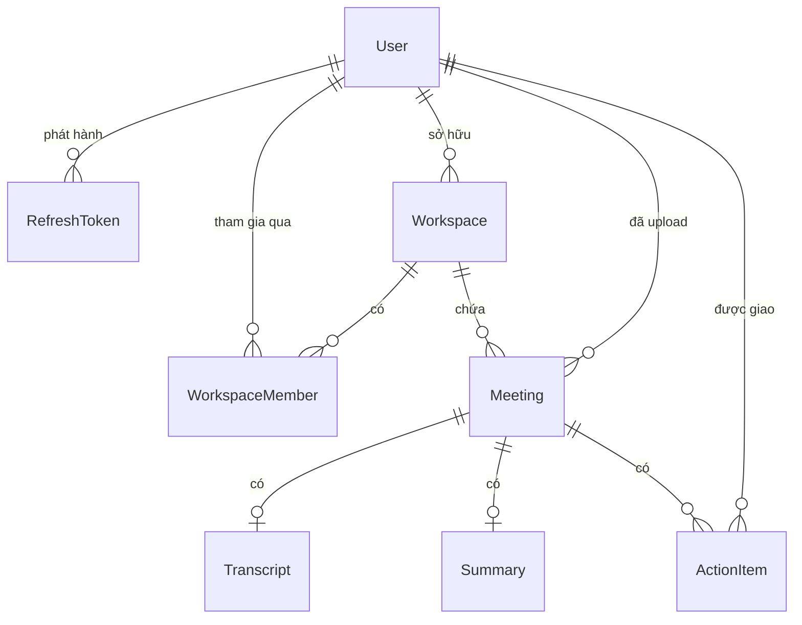

# Mô hình dữ liệu

[← Mục lục tài liệu](../README.md)

Nguồn chuẩn: [`apps/api/prisma/schema.prisma`](../../apps/api/prisma/schema.prisma).

Dùng Prisma 7 với generator `prisma-client` (output: `apps/api/generated/prisma`,
CommonJS) và driver adapter `@prisma/adapter-pg`. Khối `datasource` **không** có
`url` — chuỗi kết nối được cấp bởi
[`apps/api/prisma.config.ts`](../../apps/api/prisma.config.ts) cho các lệnh CLI,
và bởi `PrismaService` lúc runtime, cả hai đều đọc `DATABASE_URL`.

## Quan hệ thực thể

Mọi khóa chính đều là chuỗi `uuid` sinh bởi giá trị mặc định của database.

## Các model

### `User`

| Trường | Kiểu | Ghi chú |
| --- | --- | --- |
| `id` | `String` | PK |
| `email` | `String` | Unique |
| `passwordHash` | `String` | bcrypt, cost 10 |
| `createdAt` / `updatedAt` | `DateTime` | |

Mật khẩu gốc không bao giờ được lưu. Tính duy nhất của `email` được đảm bảo ở
tầng database **và** kiểm tra trong `AuthService.register`, trả về
`400 Email already exists`.

### `RefreshToken`

Mỗi refresh token đã phát hành là một dòng.

| Trường | Kiểu | Ghi chú |
| --- | --- | --- |
| `id` | `String` | PK — **chính là `jti` của JWT**, nên tra token về đúng dòng mà không cần quét bảng |
| `userId` | `String` | FK → `User`, cascade delete. Có index |
| `tokenHash` | `String` | Unique. **SHA-256 của token**, không phải bản thân token |
| `expiresAt` | `DateTime` | Khớp với `exp` của JWT |
| `revokedAt` | `DateTime?` | `null` khi còn hiệu lực |
| `createdAt` | `DateTime` | |

Chỉ lưu hash nghĩa là lộ database cũng không replay lại được. `revokedAt` phục vụ
cả logout lẫn xoay vòng token. Xem [Xác thực](authentication.md).

### `Workspace`

| Trường | Kiểu | Ghi chú |
| --- | --- | --- |
| `id` | `String` | PK |
| `name` | `String` | ≤ 120 ký tự (DTO ép) |
| `ownerId` | `String` | FK → `User`, cascade delete. Có index |
| `createdAt` / `updatedAt` | `DateTime` | |

`ownerId` chỉ là tiện lợi denormalize. Người tạo **đồng thời** nhận một dòng
`WorkspaceMember` với role `OWNER`, nhờ vậy mọi kiểm tra membership và quyền hạn
đều có một nguồn chuẩn duy nhất thay vì phải xử lý riêng cho chủ sở hữu.

### `WorkspaceMember`

Bảng nối, mang theo role của thành viên.

| Trường | Kiểu | Ghi chú |
| --- | --- | --- |
| `id` | `String` | PK |
| `workspaceId` | `String` | FK → `Workspace`, cascade delete |
| `userId` | `String` | FK → `User`, cascade delete. Có index |
| `role` | `WorkspaceRole` | Mặc định `MEMBER` |
| `createdAt` | `DateTime` | |

Unique trên `(workspaceId, userId)` — đây là khóa kép mà mọi truy vấn đều dùng.

### `Meeting`

Bản ghi âm/ghi hình đã upload cùng trạng thái xử lý của nó.

| Trường | Kiểu | Ghi chú |
| --- | --- | --- |
| `id` | `String` | PK |
| `workspaceId` | `String` | FK → `Workspace`, cascade delete. Có index |
| `uploadedById` | `String` | FK → `User` (**không** cascade) |
| `title` | `String` | ≤ 200 ký tự |
| `description` | `String?` | ≤ 2000 ký tự |
| `status` | `MeetingStatus` | Mặc định `UPLOADED` — **hiện không bao giờ được cập nhật** |
| `storageKey` | `String` | Khóa opaque trỏ vào `StorageService` |
| `originalName` | `String` | Tên file phía client, dùng cho header tải về |
| `mimeType` | `String` | Bắt buộc `audio/*` hoặc `video/*` |
| `fileSize` | `Int` | Bytes |
| `durationSec` | `Int?` | **Hiện không bao giờ được ghi** |
| `createdAt` / `updatedAt` | `DateTime` | |

**Bytes thô không bao giờ vào database** — chỉ có `storageKey`. Xem
[Lưu trữ file](storage.md).

### `Transcript` và `Summary`

Cả hai đều 1:1 với một meeting (`meetingId` là unique) và dùng chung máy trạng
thái `ProcessingStatus`.

| Trường | `Transcript` | `Summary` |
| --- | --- | --- |
| `status` | `ProcessingStatus`, mặc định `PENDING` | như trên |
| kết quả | `text String?`, `segments Json?`, `language String?` | `content String?`, `model String?` |
| `error` | `String?` | `String?` |

Cả hai được ghi bằng một `upsert`: tạo dòng mới ở trạng thái `PENDING`, hoặc đưa
dòng đã có về lại `PENDING` và xóa kết quả cùng lỗi trước đó. Không có gì đẩy
chúng vượt qua `PENDING` — xem [Hạn chế đã biết](../known-gaps.md).

### `ActionItem`

| Trường | Kiểu | Ghi chú |
| --- | --- | --- |
| `id` | `String` | PK |
| `meetingId` | `String` | FK → `Meeting`, cascade delete. Có index |
| `content` | `String` | ≤ 500 ký tự |
| `assigneeId` | `String?` | FK → `User`, **`SetNull`** khi xóa. Có index |
| `dueDate` | `DateTime?` | |
| `status` | `ActionItemStatus` | Mặc định `OPEN` |
| `createdAt` / `updatedAt` | `DateTime` | |

Người được giao phải là thành viên workspace của meeting — kiểm tra trong
`ActionItemsService.assertAssigneeIsMember`, trả về
`400 Assignee must be a member of the workspace`.

## Các enum

| Enum | Giá trị | Dùng bởi |
| --- | --- | --- |
| `WorkspaceRole` | `OWNER`, `ADMIN`, `MEMBER` | `WorkspaceMember.role` |
| `MeetingStatus` | `UPLOADED`, `PROCESSING`, `TRANSCRIBED`, `SUMMARIZED`, `FAILED` | `Meeting.status` |
| `ProcessingStatus` | `PENDING`, `PROCESSING`, `COMPLETED`, `FAILED` | `Transcript.status`, `Summary.status` |
| `ActionItemStatus` | `OPEN`, `IN_PROGRESS`, `DONE` | `ActionItem.status` |

Hiện chỉ `ActionItemStatus` và giá trị khởi tạo của các enum còn lại từng được
ghi. `MeetingStatus` dừng ở `UPLOADED` còn `ProcessingStatus` dừng ở `PENDING`.

## Cascade khi xóa

| Xóa | Cũng xóa theo | Cũng set NULL |
| --- | --- | --- |
| `User` | Refresh token, membership, workspace họ sở hữu (và mọi thứ bên dưới) | `ActionItem.assigneeId` trên các task họ được giao |
| `Workspace` | Thành viên và meeting của nó (và mọi thứ bên dưới) | — |
| `Meeting` | Transcript, summary và action item của nó | — |

`Meeting.uploadedById` **không** có quy tắc cascade, nên xóa một user từng upload
meeting vào workspace của người khác sẽ lỗi ràng buộc khóa ngoại, trừ khi
workspace đó cũng bị xóa cùng.

Xóa meeting qua API còn xóa file đã lưu theo kiểu best-effort; dòng database bị
xóa trước, nên lỗi ở tầng storage không làm hỏng request (đổi lại sẽ để lại một
file mồ côi).

## Migration

Hai migration nằm trong
[`apps/api/prisma/migrations/`](../../apps/api/prisma/migrations):

| Migration | Thêm |
| --- | --- |
| `20260531092957_add_refresh_token` | `RefreshToken` |
| `20260604000000_add_workspaces_meetings` | Workspace, thành viên, meeting, transcript, summary, action item và các enum |

Xem [Phát triển](../development.md) cho quy trình Prisma.
