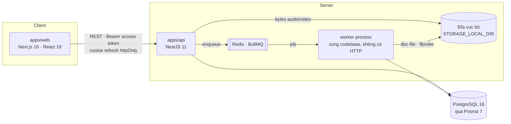
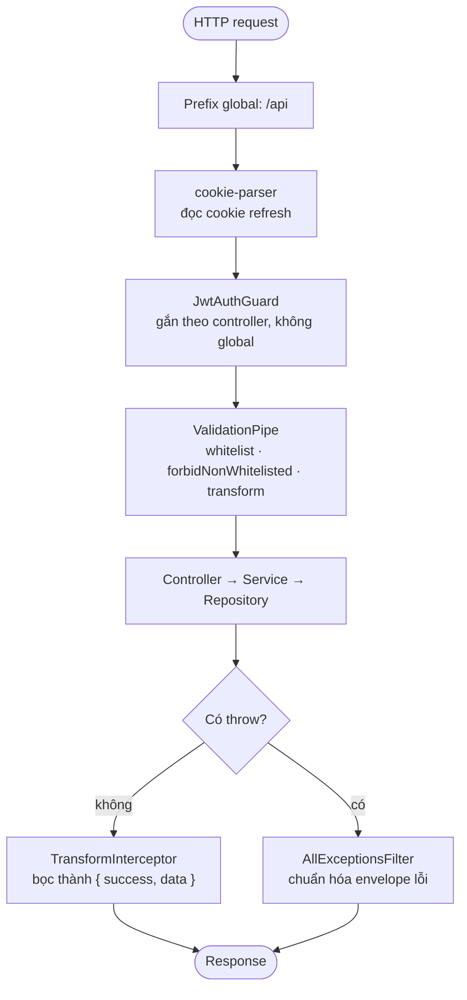
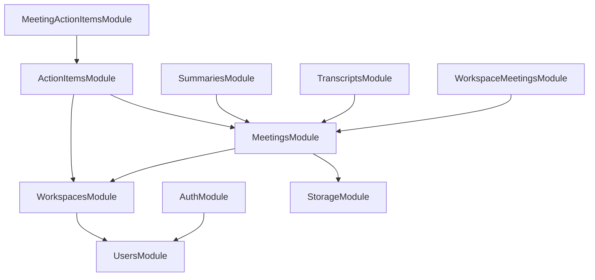

# Tổng quan kiến trúc

[← Mục lục tài liệu](../README.md)

## Hình dạng hệ thống

Hai ứng dụng triển khai độc lập, giao tiếp qua HTTP. API nắm toàn bộ phần lưu trữ
và mọi quyết định phân quyền; web app là client thuần, không giữ state có thẩm
quyền nào.



Có **hai process** trên cùng một codebase: API phục vụ HTTP, worker chỉ nghe
Redis. Chi tiết ở [Hàng đợi và worker](queue-and-worker.md).

Chưa có lớp WebSocket nào — `@nestjs/websockets` và `socket.io` đã cài nhưng chưa
dùng, xem [Hạn chế đã biết](../known-gaps.md).

## Request pipeline

Toàn bộ được cấu hình trong
[`apps/api/src/main.ts`](../../apps/api/src/main.ts) và áp dụng ở phạm vi global:



Những điểm cần nắm:

- **`forbidNonWhitelisted`** nghĩa là một thuộc tính lạ trong body sẽ trả `400`,
  chứ không bị bỏ qua âm thầm. Client phải gửi đúng những gì DTO khai báo.
- **`transform: true`**, cộng với `enableImplicitConversion` trên schema env, là
  lý do các biến môi trường kiểu số như `PORT` về tới nơi đã là number.
- **`TransformInterceptor` bỏ qua `StreamableFile`**, nên route tải file trả về
  bytes thô thay vì bị bọc trong JSON.
- **CORS** đang là `origin: true` (phản chiếu mọi origin) kèm `credentials: true`.
  Điều này cố ý để tiện phát triển local và cần một allowlist trước khi lên
  production.
- **Validate biến môi trường chạy trước khi app khởi động.** Thiếu hoặc sai định
  dạng sẽ throw ngay lúc bootstrap chứ không đợi đến lúc dùng. Xem
  [Cấu hình](../configuration.md).

## Bảng route tập trung

Các controller của feature được khai báo **không có prefix** (`@Controller()`),
còn toàn bộ cây URL nằm gọn trong một file,
[`apps/api/src/app.routes.ts`](../../apps/api/src/app.routes.ts), đăng ký qua
`RouterModule` của Nest:

| Prefix | Module |
| --- | --- |
| `workspaces` | `WorkspacesModule` |
| `workspaces/:workspaceId/meetings` | `WorkspaceMeetingsModule` |
| `meetings` | `MeetingsModule` |
| `meetings/:meetingId/transcript` | `TranscriptsModule` |
| `meetings/:meetingId/summary` | `SummariesModule` |
| `meetings/:meetingId/action-items` | `MeetingActionItemsModule` |
| `action-items` | `ActionItemsModule` |

`AuthModule` là ngoại lệ cố ý — nó giữ `@Controller('auth')` riêng và không nằm
trong bảng này.

Đây cũng là lý do một số domain có **hai module**: `MeetingsModule` phục vụ
`/meetings/:id`, còn `WorkspaceMeetingsModule` phục vụ
`/workspaces/:workspaceId/meetings`. Action items cũng tách y hệt. Hai nửa dùng
chung một service, chỉ khác điểm mount.

## Đồ thị phụ thuộc giữa các module



`PrismaModule` là `@Global()`, nên `PrismaService` inject được ở mọi nơi mà không
cần import tường minh.

Chiều phụ thuộc này chính là mô hình phân quyền: mọi thứ nằm dưới một meeting đều
đi qua `MeetingsService.loadAccessible`, hàm này tra ra workspace của meeting rồi
ủy quyền cho `WorkspacesService.assertMember`. Quyền truy cập luôn được thừa kế
từ workspace — xem [Phân quyền](authorization.md).

## Hình dạng web app

```
apps/web/app/
  (auth)/         Công khai: /login, /register
  (app)/          Có bảo vệ: /dashboard, /workspaces/[id], /meetings/[id]
```

Layout `(app)` là một client component: nó chờ quá trình bootstrap phiên đăng
nhập hoàn tất rồi chuyển hướng về `/login` nếu không có user. `AuthProvider` khôi
phục phiên ở lần load đầu tiên bằng cách gọi `/auth/refresh` với cookie httpOnly.

Việc lấy dữ liệu do TanStack Query đảm nhiệm, bên trên một axios instance duy
nhất ([`src/lib/api.ts`](../../apps/web/src/lib/api.ts)) lo phần gắn token,
refresh ngầm và bóc envelope. Xem [Xác thực](authentication.md).

## Liên quan

- [Quy ước code](conventions.md) — bố cục một feature module
- [Mô hình dữ liệu](data-model.md)
- [Hạn chế đã biết](../known-gaps.md)
