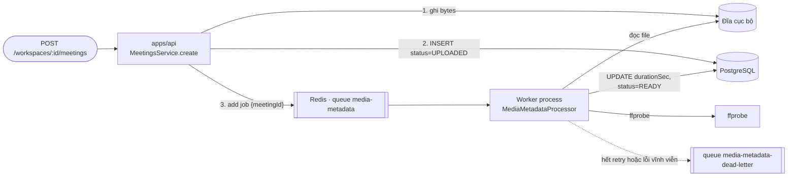
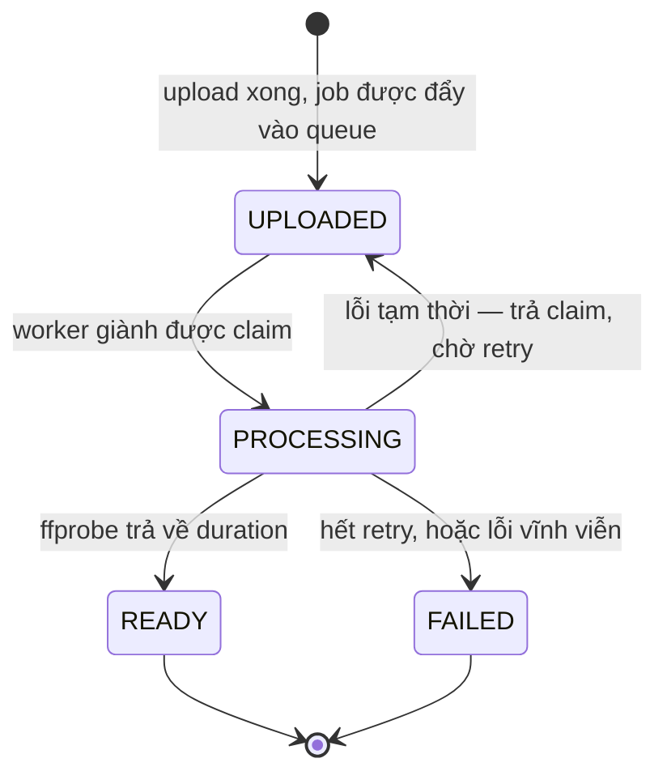

# Hàng đợi và worker

[← Mục lục tài liệu](../README.md)

Hệ thống có process thứ hai: **worker**. Nó không phục vụ HTTP, chỉ ngồi nghe
Redis và xử lý job. Hiện có đúng một loại job — đo thời lượng của file vừa upload
bằng `ffprobe` — và cái đó là *cố ý*: hạ tầng bất đồng bộ được dựng và kiểm chứng
bằng một việc không dính đến AI, để khi job AI vào ở giai đoạn sau, lỗi phát sinh
chắc chắn là lỗi AI chứ không phải lỗi queue.



Producer và consumer **không hề biết nhau**. Cả hai chỉ biết tên queue trong
[`src/queue/queues.ts`](../../apps/api/src/queue/queues.ts) — đó là toàn bộ hợp
đồng giữa hai process.

## Chạy nó

```bash
# Redis (kèm trong docker-compose ở gốc repo)
docker compose up -d

# ffprobe là system package, không phải npm dependency
sudo apt install ffmpeg

cd apps/api
pnpm start:dev        # API — enqueue
pnpm start:worker:dev # Worker — consume
```

API vẫn chạy được khi không có worker: meeting sẽ nằm ở `UPLOADED` cho tới khi có
worker nhấc job lên. Nhưng API **không** boot được khi không có Redis, vì
`MeetingsService` inject queue ngay lúc khởi tạo.

## Vòng đời một meeting



`READY` nghĩa là "media đã được kiểm tra, biết dài bao nhiêu, sẵn sàng cho bước
transcribe" — nó không nói gì về AI, và giai đoạn AI sẽ nối tiếp từ đây.

## Bốn tính chất phải giữ

Queue hứa giao **ít nhất một lần**, không phải đúng một lần. Mọi thứ trong
[`media-metadata.processor.ts`](../../apps/api/src/worker/processors/media-metadata.processor.ts)
đều được viết với giả định job này có thể đến hai lần, hoặc process có thể chết
giữa chừng.

### 1. Chạy lại không được làm hỏng dữ liệu

Việc đầu tiên processor làm là hỏi *kết quả đã có chưa*: nếu `durationSec` khác
`null` thì job kết thúc ngay với `already-probed`, không claim, không gọi
`ffprobe`. Trường hợp giao trùng phải **rẻ**, chứ không chỉ là "vô hại".

Ở tầng queue, job dùng `jobId = meetingId`, nên hai lần enqueue cho cùng một
meeting chỉ tạo ra một job.

### 2. Không bao giờ hai worker cùng làm một meeting

Claim là một câu UPDATE có điều kiện, và nó trả lời luôn *ai là người giành
được*:

```ts
// meeting.repository.ts
const { count } = await this.prisma.meeting.updateMany({
  where: { id, status: { in: claimable } },
  data: { status: MeetingStatus.PROCESSING },
});
return count > 0;
```

Đây đúng hình dạng của việc "tiêu" một refresh token trong
[Xác thực](authentication.md): đọc rồi ghi ở hai câu lệnh riêng sẽ để lại khe hở
cho hai bên cùng tin là mình thắng.

### 3. Job của chính mình chết giữa chừng thì vẫn tiếp tục được

Nếu worker bị kill khi đang probe, meeting nằm lại ở `PROCESSING`. Lần thử lại
sau đó **không** claim được từ `UPLOADED` nữa, và nếu chỉ có thế thì meeting kẹt
vĩnh viễn.

Nên claim có thêm tham số `resuming`: lần thử thứ hai trở đi được phép lấy lại
một meeting đang ở `PROCESSING`. Lần thử **đầu tiên** thì không — nếu không, hai
worker khác nhau lại cùng giành một meeting, tức là phá luôn tính chất số 2.

### 4. Kết quả cũ không được đè lên trạng thái mới

Lệnh ghi kết quả cũng có điều kiện (`where status = PROCESSING`). Một job chạy
chậm quay về sau khi meeting đã đi tiếp sẽ nhận `false` và bỏ kết quả của mình
đi, thay vì kéo trạng thái lùi lại.

## Lỗi tạm thời và lỗi vĩnh viễn

Phân loại sai thì trả giá ở cả hai đầu: retry một file hỏng là đốt queue vào việc
không bao giờ xong được, còn đánh `FAILED` một meeting chỉ vì thiếu binary là làm
mất dữ liệu người dùng đã giao cho mình.

| Chuyện gì xảy ra | Loại | Hệ quả |
| --- | --- | --- |
| `ffprobe` không tồn tại (`ENOENT`) | tạm thời | Trả claim, retry với backoff |
| `ffprobe` chạy quá `MEDIA_PROBE_TIMEOUT_MS` | tạm thời | Như trên |
| `ffprobe` exit khác 0 (file hỏng, không phải media) | **vĩnh viễn** | `UnrecoverableError` — không retry |
| File không có trong storage | **vĩnh viễn** | Như trên |
| Container không mang duration | **vĩnh viễn** | Như trên |

Lỗi tạm thời được thử lại 3 lần: ngay lập tức, sau 2s, sau 4s (exponential
backoff). Khoảng cách ngắn là có chủ đích — probe media rất nhanh, nên job chưa
xong sau vài giây retry thì gần như chắc chắn là input hỏng chứ không phải trục
trặc thoáng qua.

## Dead-letter queue

Job không còn được thử lại nữa — hết retry, hoặc lỗi vĩnh viễn — sẽ đi qua
`@OnWorkerEvent('failed')`:

1. Meeting chuyển sang `FAILED` (chỉ khi nó còn ở `UPLOADED`/`PROCESSING`; một
   meeting đã có transcript thì không bị một job metadata muộn đánh hỏng).
2. Một bản tóm tắt được đẩy vào queue `media-metadata-dead-letter`, kèm lý do, số
   lần đã thử và `retriesExhausted` để phân biệt "hết lượt" với "hỏng hẳn từ đầu".

BullMQ vốn đã giữ job fail trong set riêng của nó. Queue dead-letter tồn tại để
job chết là **một thứ người ta mở ra đọc và replay được**, chứ không phải một
record trong cấu trúc nội bộ của thư viện.

```bash
# Có gì trong đó
redis-cli LLEN bull:media-metadata-dead-letter:wait
```

Chưa có endpoint replay. Hiện muốn chạy lại thì phải đẩy job thủ công vào queue
`media-metadata`.

## Tắt máy êm

`worker/main.ts` gọi `app.enableShutdownHooks()`. Khi nhận `SIGTERM`,
`@nestjs/bullmq` đóng BullMQ worker: nó ngừng nhận job mới và **chờ job đang chạy
xong**.

Nếu bị kill nặng tay hơn (`SIGKILL`, máy sập), job không mất: lock của nó hết
hạn, BullMQ đánh dấu `stalled` và giao lại cho worker khác — đúng cái cơ chế
at-least-once mà bốn tính chất ở trên tồn tại để sống chung.

## Những chỗ còn hở

- **Enqueue thất bại thì chỉ được log.** Bytes đã ghi và row đã tạo trước đó, nên
  Redis chết không được phép biến upload thành lỗi 500. Cái giá là meeting nằm ở
  `UPLOADED` mà không có job nào phía sau, và chưa có sweep nào đi dọn.
- **Chưa có endpoint replay** cho dead-letter queue.
- **`localPath` là chỗ backend đĩa cục bộ lộ ra.** `ffprobe` cần một đường dẫn,
  không phải stream. Khi có backend S3, đây là chỗ phải đổi thành "tải về một bản
  tạm" và worker là caller duy nhất phải sửa.
- **Chưa có tiến độ realtime.** UI chỉ thấy trạng thái mới khi refetch; đẩy sự
  kiện xuống client là việc của giai đoạn WebSocket.
