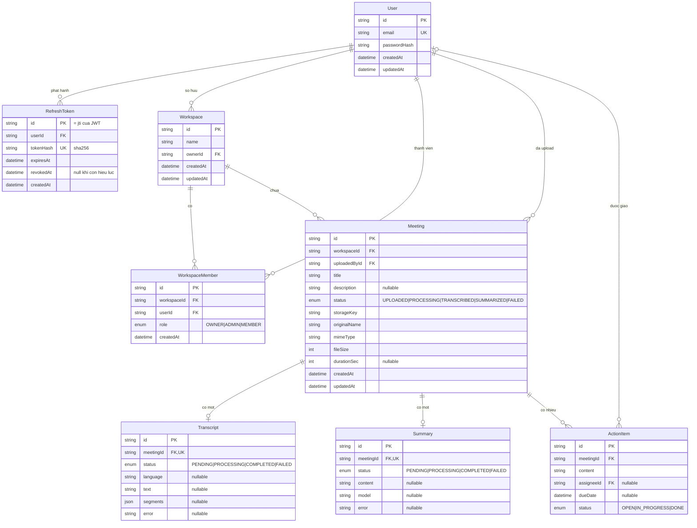
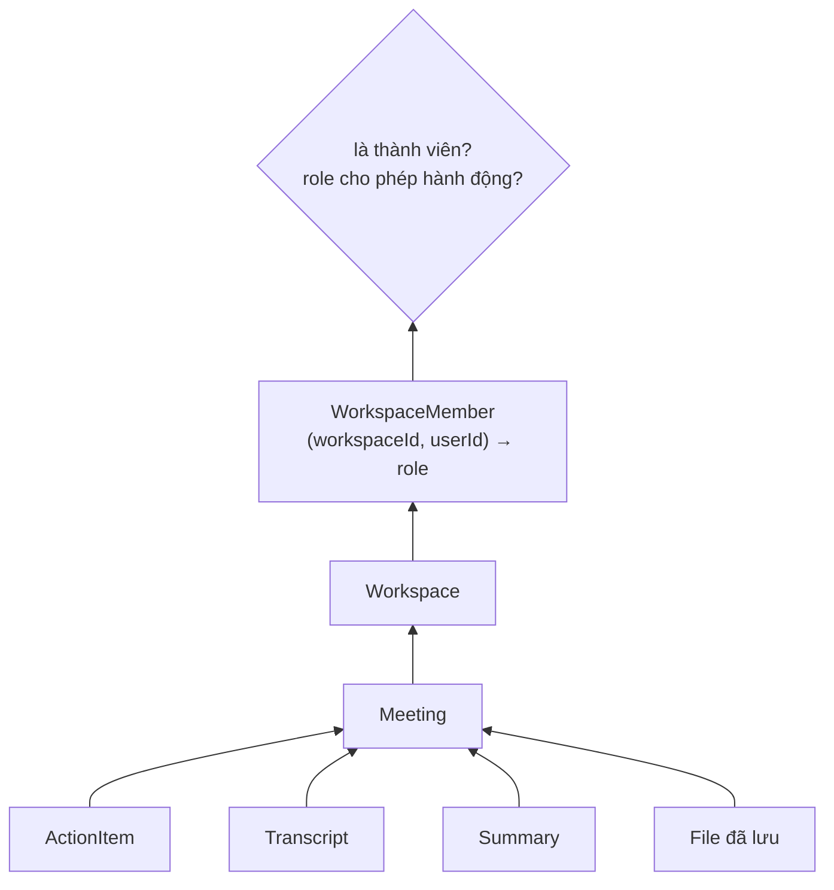
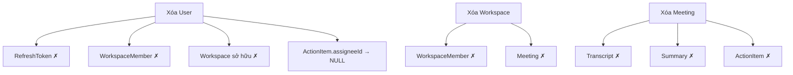

# Sơ đồ quan hệ thực thể

[← Mục lục tài liệu](../README.md) · [Tham chiếu mô hình dữ liệu](../architecture/data-model.md)

## Toàn bộ schema

## Đường kiểm tra quyền

Mọi quyết định phân quyền đều lần ngược về một dòng `WorkspaceMember`:

## Cascade khi xóa

`✗` = dòng bị xóa. Lưu ý **không cascade nào đụng tới file đã lưu** — xóa một
workspace sẽ để lại mồ côi toàn bộ bản ghi đã upload bên trong. Chỉ route xóa
meeting mới xóa file, và cũng chỉ theo kiểu best-effort.

`Meeting.uploadedById` không có quy tắc cascade, nên xóa một user từng upload vào
workspace mà họ không sở hữu sẽ lỗi ràng buộc khóa ngoại.

## Ràng buộc unique và index

| Model | Unique | Có index |
| --- | --- | --- |
| `User` | `email` | — |
| `RefreshToken` | `tokenHash` | `userId` |
| `Workspace` | — | `ownerId` |
| `WorkspaceMember` | `(workspaceId, userId)` | `userId` |
| `Meeting` | — | `workspaceId` |
| `Transcript` | `meetingId` | — |
| `Summary` | `meetingId` | — |
| `ActionItem` | — | `meetingId`, `assigneeId` |
