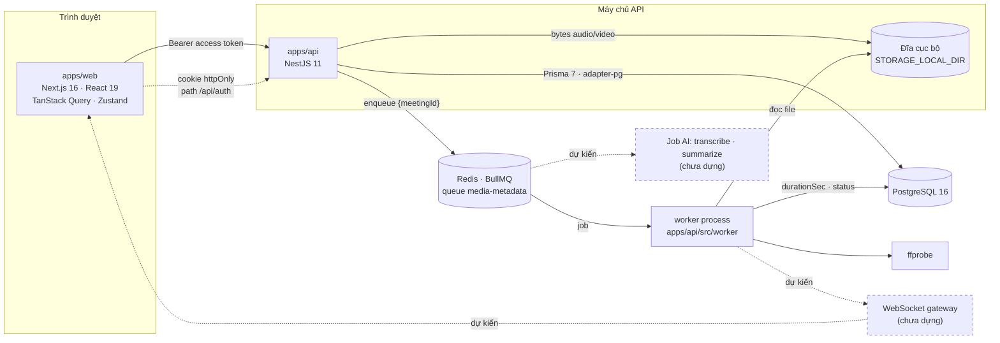
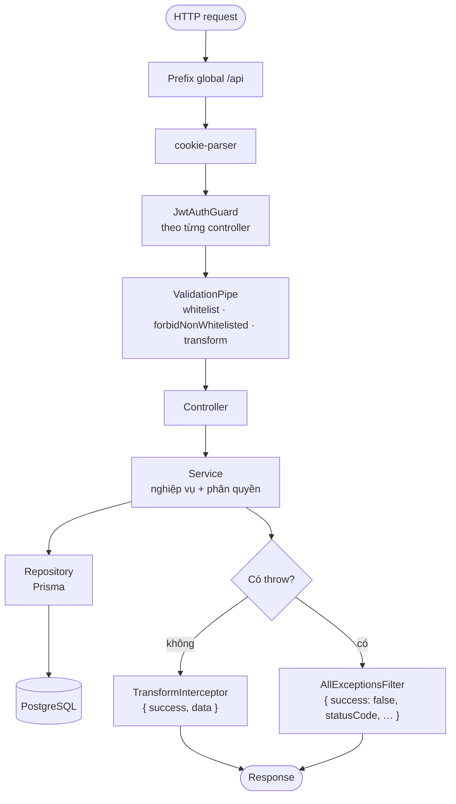
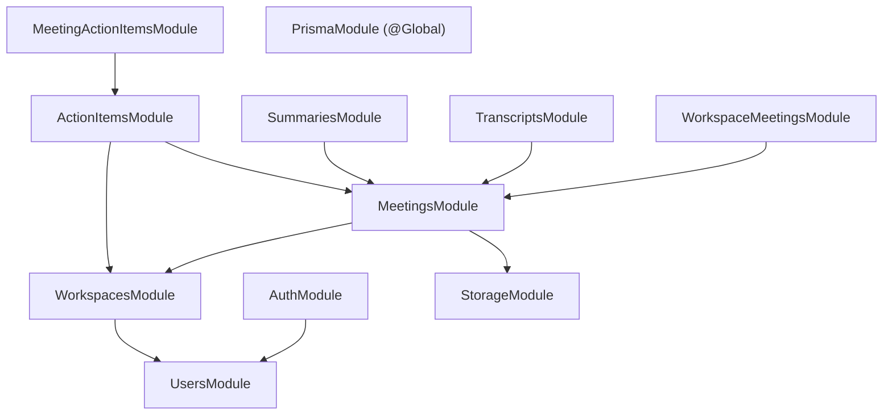
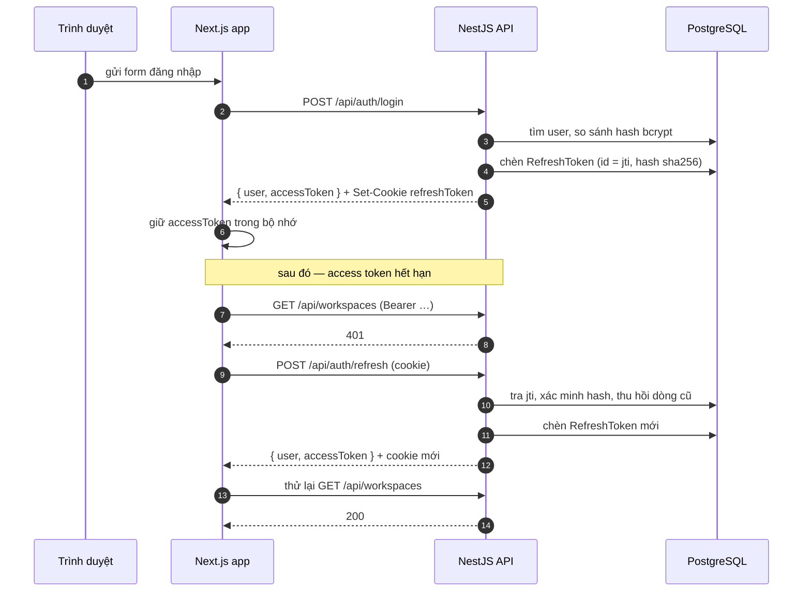
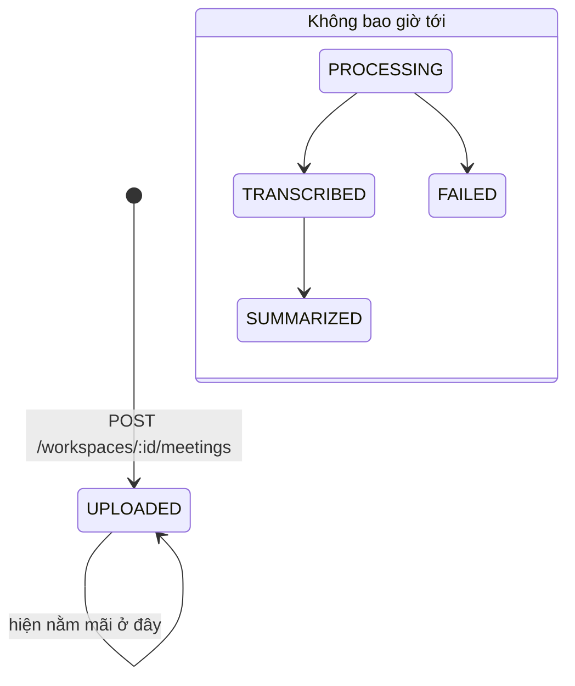
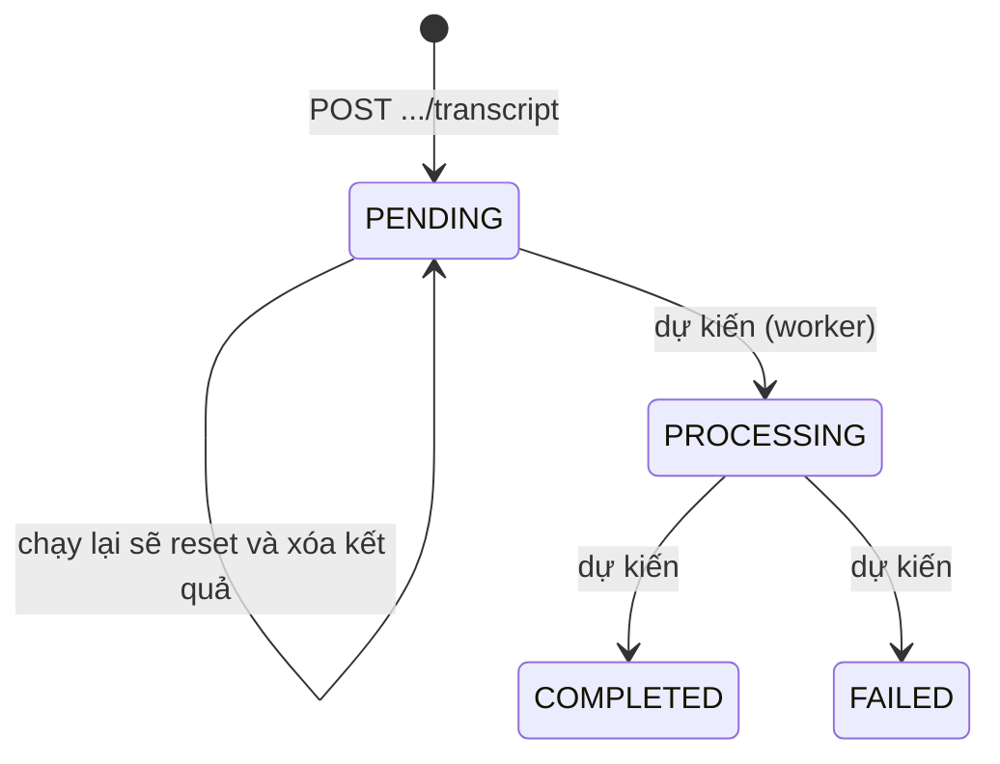
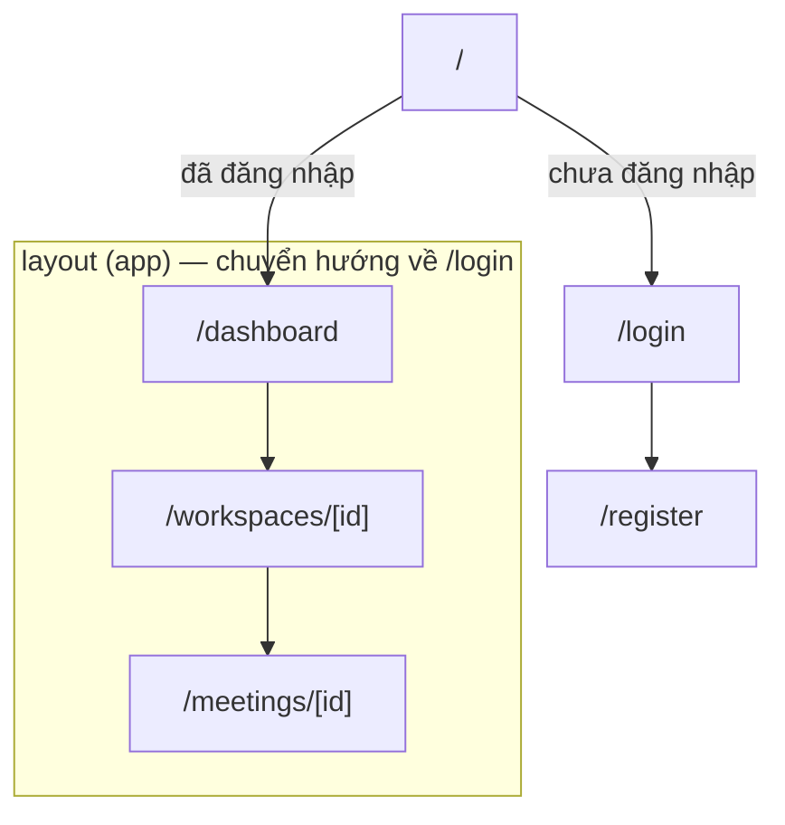

# Sơ đồ kiến trúc hệ thống

[← Mục lục tài liệu](../README.md) · [Tổng quan kiến trúc](../architecture/overview.md)

Tất cả sơ đồ đều viết bằng Mermaid và render trực tiếp trên GitHub.

## Thành phần

Các thành phần nét đứt chưa tồn tại — xem [Hạn chế đã biết](../known-gaps.md) và
[Hàng đợi và worker](../architecture/queue-and-worker.md).

## Request pipeline

## Phụ thuộc giữa các module

Chiều mũi tên chính là mô hình phân quyền: mọi thứ nằm dưới một meeting đều đi
tới `MeetingsService.loadAccessible`, hàm này tra ra workspace rồi ủy quyền cho
`WorkspacesService.assertMember`.

## Trình tự xác thực

## Vòng đời meeting (thực tế so với dự kiến)

Transcript và summary có máy trạng thái riêng, hiện chỉ dừng ở `PENDING`:

## Cấu trúc route phía web

