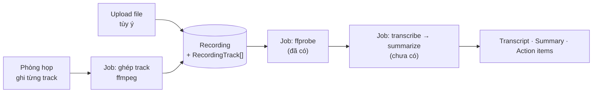

# Lộ trình

[← Mục lục tài liệu](README.md)

Bản đầu của lộ trình này xếp theo **kỹ thuật học được trên mỗi giờ bỏ ra**, và
sản phẩm dừng ở "upload bản ghi rồi xử lý". Mục tiêu đã đổi: giờ phải có **phòng
họp trực tiếp như Meet/Zoom, ghi hình được, và vẫn upload video tùy ý**.

Đổi mục tiêu chứ không phải thêm một giai đoạn — nên thứ tự bên dưới được xếp
lại từ đầu. Tiêu chí học được giữ nguyên, chỉ là giờ nó không còn là tiêu chí duy
nhất.

## Nguyên tắc

**Sâu hơn rộng.** Thêm một tính năng na ná những cái đã có thì gần như không dạy
thêm gì.

**Mọi việc đều có một phiên bản đáng học.** Không có tính năng nào "chỉ là CRUD"
một cách tất yếu — phân trang có thể là `skip/take` hoặc keyset pagination.

**Mỗi giai đoạn phải có test.** Test là cách duy nhất biết mình hiểu đúng cái vừa
viết.

**Mỗi giai đoạn một PR riêng.**

**Ghi lại quyết định.** `docs/` là thứ tốt nhất của repo này. Lưu ý ranh giới:
`docs/architecture/` mô tả **cái đang có thật**, file này mô tả **cái định làm**.
Đừng viết kiến trúc cho thứ chưa tồn tại.

---

# Phần I — Đã xong

## Giai đoạn 0 — Lưới an toàn ✅

Test đầu tiên, CI đầu tiên. Bài học đắt nhất không nằm ở việc viết test mà ở việc
**kiểm chứng test có bắt được lỗi không**: bản đầu của integration test vẫn xanh
khi revert bản vá race condition. Bắn hai request rồi mong chúng đụng nhau là
không đủ — cửa sổ chỉ vài mili-giây. Phải chặn cả hai caller bằng barrier ngay
sau bước đọc rồi mới thả vào bước ghi.

## Giai đoạn 1 — Worker bất đồng bộ ✅

Queue BullMQ, worker là process riêng, job `media-metadata` chạy `ffprobe`. Cố ý
chọn một job **không dính AI** để hạ tầng async được kiểm chứng trước.

Chỗ khó không phải producer/consumer mà là trạng thái *giữa chừng*: claim bằng
UPDATE có điều kiện chặn được hai worker cùng một meeting, nhưng lại làm meeting
kẹt ở `PROCESSING` nếu worker chết giữa lúc probe. Claim phải phân biệt "lần đầu"
với "chính tôi thử lại". Chi tiết: [Hàng đợi và worker](architecture/queue-and-worker.md).

**Cái này là nền cho toàn bộ phần còn lại.** Ghi hình xong một cuộc họp là một
job. Ghép track là một job. Transcribe là một job. Tất cả đi vào đúng hạ tầng đã
dựng.

---

# Phần II — Ba ràng buộc trước khi bàn giai đoạn

Ba thứ này quyết định hình dạng mọi giai đoạn sau. Bàn trước, không bàn xen kẽ.

## 1. Nguyên tắc hội tụ: một pipeline, hai nguồn

Cuộc họp trực tiếp và video upload **phải kết thúc ở cùng một chỗ**. Nếu không,
mọi thứ phía sau — transcript, summary, action item, tìm kiếm — phải viết hai
lần và sẽ lệch nhau.



Upload không phải là đường phụ để tương thích ngược. Nó là **một trong hai nguồn
ngang hàng**, và là đường duy nhất chạy được ngay hôm nay.

## 2. Schema hiện tại chặn cuộc họp trực tiếp

Đây là thứ phải sửa trước khi viết được dòng WebRTC nào:

```prisma
model Meeting {
  storageKey   String   // NOT NULL
  originalName String   // NOT NULL
  mimeType     String   // NOT NULL
  fileSize     Int      // NOT NULL
}
```

Một cuộc họp trực tiếp **chưa có file nào cho tới khi họp xong**. Bốn cột này
không thể điền lúc tạo phòng.

Cách sửa (không phải nới thành nullable — làm thế thì mọi caller phải tự đoán khi
nào có file): tách phần file ra khỏi `Meeting`.

| Model | Vai trò |
| --- | --- |
| `Meeting` | Cái vỏ: workspace, tiêu đề, trạng thái, `source: LIVE \| UPLOAD` |
| `Recording` | Một file cuối cùng — do upload trực tiếp, hoặc do ghép track sinh ra |
| `RecordingTrack` | Một track của một người: `storageKey`, `kind`, `offsetMs`, `durationSec` |
| `MeetingParticipant` | Ai vào phòng, vào lúc nào, ra lúc nào |

`MeetingParticipant` **không** thay được `WorkspaceMember`: thành viên workspace
là quyền truy cập, người tham gia là sự kiện đã xảy ra. Một người có thể là thành
viên mà không dự, và về lâu dài có thể dự mà không phải thành viên (khách mời).

Đây là **breaking change với các endpoint meeting đang có** — cần migration và
sửa cả web. Làm sớm ở GĐ 3 thì rẻ, để tới sau GĐ 5 thì đắt gấp nhiều lần vì lúc
đó transcript và summary đã bám vào hình dạng cũ.

## 3. TURN không phải tùy chọn

STUN chỉ giúp hai máy tự tìm ra nhau. Khi một bên nằm sau NAT đối xứng hoặc
firewall doanh nghiệp, media **phải relay qua TURN**, và tỉ lệ này ở mạng thật
thường vào khoảng một phần mười tới một phần năm số kết nối — đủ lớn để "chạy tốt
trên máy tôi" trở thành "khách hàng không nghe thấy gì".

TURN tốn băng thông thật vì toàn bộ media đi xuyên qua nó. Đây là khoản hạ tầng
tốn tiền đầu tiên của dự án.

| Đường | TURN lấy từ đâu |
| --- | --- |
| LiveKit | Có TURN nhúng sẵn trong `livekit-server` |
| P2P / mediasoup tự viết | Phải tự dựng **coturn** |

---

# Phần III — Kiến trúc: một interface, nhiều backend

Bạn muốn học **cả hai**: dùng LiveKit và tự build, đổi qua lại bằng strategy
pattern. Việc này làm được, và repo đã có sẵn đúng idiom đó: `StorageService` là
một abstraction mà hôm nay chỉ có backend đĩa cục bộ, mai đổi sang S3 mà không
caller nào phải sửa.

## Interface phía server

```ts
interface MediaRoomService {
  createRoom(meetingId: string): Promise<RoomHandle>;
  issueJoinToken(meetingId: string, userId: string): Promise<JoinCredential>;
  startRecording(meetingId: string): Promise<void>;   // per-track
  stopRecording(meetingId: string): Promise<RecordedTrack[]>;
  closeRoom(meetingId: string): Promise<void>;
  // sự kiện: participantJoined/Left, trackPublished, recordingFinished
}
```

Ba bậc thang, mỗi bậc là một implementation của **cùng** interface trên:

| Bậc | Backend | Học được gì | Ghi hình được không |
| --- | --- | --- | --- |
| 1 | **LiveKit self-hosted** | Vận hành SFU thật, token/room model, Egress, TURN nhúng | ✅ track egress có sẵn |
| 2 | **P2P mesh tự viết** *(tùy chọn)* | SDP offer/answer, ICE candidate, STUN/TURN, tự viết signaling | ❌ chỉ ghi được phía client |
| 3 | **mediasoup SFU tự viết** | Transport/producer/consumer, routing RTP, tự dựng pipeline ghi hình | ✅ nhưng phải tự viết toàn bộ |

Bậc 2 **không ghi hình phía server được** — đó chính là bài học của nó: khi không
có server nào nhìn thấy media, muốn ghi thì chỉ còn cách nhờ trình duyệt của một
người tham gia. Đây là lý do cụ thể, sờ được, khiến SFU tồn tại.

## Chỗ abstraction sạch và chỗ nó rò

Phải nói trước, vì đây là chỗ kế hoạch dễ vỡ nhất:

**Sạch (phía server):** vòng đời phòng, cấp token, bật/tắt ghi hình, sự kiện
người vào/ra. Đây đúng là nơi strategy pattern hoạt động tốt.

**Rò (phía client):** `livekit-client` và `mediasoup-client` là hai mô hình khác
hẳn nhau. Bọc chung được một `MediaSession` với `join()` / `publishCamera()` /
`on('participant')`, nhưng bốn thứ này sẽ rò qua lớp bọc: **simulcast**, **ngữ
nghĩa reconnect**, **chia sẻ màn hình**, **chọn layer khi mạng yếu**. Đừng hứa
với chính mình rằng đổi backend là đổi một biến môi trường.

**Rò (signaling):** LiveKit tự lo signaling bên trong. Bậc 2 và 3 thì bạn phải
tự viết trên WebSocket gateway. Interface giấu được điều này, nhưng nghĩa là
gateway ở GĐ 2 **chỉ thực sự cần cho đường tự build** — với LiveKit nó chỉ dùng
cho sự kiện mức ứng dụng (tiến độ job, ai đang trong phòng).

## Vì sao LiveKit trước, không phải tự build trước

Trực giác nói: làm cái nguyên thủy trước để hiểu bản chất. Ở đây trực giác sai,
vì hai lý do:

1. **Interface phải được thiết kế theo từ vựng cấp cao.** Build mediasoup trước
   thì interface sẽ đẻ ra theo khái niệm của mediasoup (transport, producer,
   consumer) — và LiveKit không lắp vừa vào đó, vì mô hình của nó là room /
   participant / track. Đi từ LiveKit trước cho bạn đúng bộ từ vựng mà cả ba bậc
   đều diễn đạt được.
2. **Bậc 3 cần một bản tham chiếu chạy đúng.** Debug WebRTC mà không có gì để đối
   chiếu là một trong những trải nghiệm tệ nhất của nghề này. Có LiveKit chạy
   được rồi thì mỗi lần bậc 3 sai, bạn biết chắc là mình sai chứ không phải trình
   duyệt hay mạng sai.

**Cái giá phải nói thẳng:** làm cả hai tốn khoảng gấp rưỡi tới gấp đôi làm một.
Và interface **sẽ phải sửa** khi implementation thứ hai lắp vào — không ai thiết
kế đúng abstraction khi mới có một trường hợp. Lần sửa đó không phải thất bại,
nó chính là bài học; nhưng phải tính trước là nó sẽ tới.

---

# Phần IV — Các giai đoạn

## Giai đoạn 2 — WebSocket gateway

Nền cho mọi thứ realtime, và là kênh signaling cho đường tự build sau này.

- [ ] Gateway `@nestjs/websockets`, xác thực JWT trong handshake
- [ ] Room theo `meetingId`, chỉ thành viên workspace được vào
- [ ] Worker đẩy tiến độ job → gateway → UI
- [ ] Web nhận event rồi invalidate cache TanStack Query

**Bài toán thật sẽ gặp:** access token nằm trong RAM và tự xoay vòng (xem
[authentication.md](architecture/authentication.md)). Một kết nối WebSocket sống
hàng giờ thì token hết hạn giữa chừng. Xử lý thế nào — đóng và bắt kết nối lại,
hay cho phép làm mới credential trên kết nối đang mở? Không có đáp án sẵn để
chép.

**Đáng làm ngay cả khi cuối cùng chỉ dùng LiveKit**, vì tiến độ job của GĐ 1 hiện
không có cách nào tới được UI ngoài refetch.

## Giai đoạn 3 — Phòng họp v1 trên LiveKit

Mục tiêu: hai người vào cùng một URL, thấy và nghe được nhau.

- [ ] **Migration tách `Recording` / `RecordingTrack` / `MeetingParticipant`**
      khỏi `Meeting` (ràng buộc số 2 ở trên) — làm trước, không làm sau
- [ ] Dựng `livekit-server` self-hosted (+ Redis; đã có sẵn từ GĐ 1)
- [ ] `MediaRoomService` bản LiveKit: tạo phòng, cấp join token, đóng phòng
- [ ] UI phòng họp: lưới video, bật/tắt mic và camera, danh sách người tham gia
- [ ] Chia sẻ màn hình
- [ ] Vào/ra phòng gắn với `MeetingParticipant`

**Chưa** trừu tượng hóa vội. Viết thẳng vào LiveKit, để interface tự lộ ra từ chỗ
code thật cần gì — GĐ 6 mới là lúc rút interface ra.

**Dấu hiệu hoàn thành:** hai máy khác mạng (không cùng WiFi) họp được với nhau.
Cùng một WiFi thì không chứng minh được gì về NAT.

## Giai đoạn 4 — Ghi hình từng track, và hội tụ vào pipeline

Đây là giai đoạn nối phòng họp vào toàn bộ công đã làm ở GĐ 1.

- [ ] Bật **track egress** của LiveKit: mỗi người một file audio riêng
- [ ] Egress ghi vào storage → sinh `RecordingTrack` kèm `offsetMs`
- [ ] Job mới `compose-recording`: ffmpeg ghép các track thành một file xem lại
- [ ] File ghép đi vào **đúng job `media-metadata` đã có** → `READY`
- [ ] Xử lý người vào muộn / rớt giữa chừng / vào lại (offset không đều nhau)
- [ ] Idempotency: egress báo xong hai lần không được đẻ hai bản ghi

**Vì sao ghi từng track thay vì một file trộn sẵn:** transcript của từng track
là lời của **đúng một người**. Ghép lại theo mốc thời gian thì biết ai nói câu
nào mà **không cần diarization** — bước khó và hay sai nhất của mọi hệ thống
transcript nhiều người. Một file trộn sẵn vứt bỏ thông tin đó vĩnh viễn, và không
lấy lại được.

Đây là lý do lựa chọn "ghi từng track" quan trọng hơn nó thoạt trông.

**Cái giá:** nhiều file hơn, phải quản mốc thời gian, và ffmpeg ghép nhiều nguồn
lệch nhau là việc thật sự khó chứ không phải một dòng lệnh.

## Giai đoạn 5 — AI pipeline ← lý do dự án tồn tại

Toàn bộ máy trạng thái đã dựng sẵn và đang chờ: `ProcessingStatus`, các cột
`text`, `segments`, `content`, `model`, `error`, endpoint request, UI cho từng
trạng thái. Chỉ thiếu phần *tiêu thụ*.

- [ ] **Transcription**: audio dài vượt giới hạn API → `ffmpeg` chia đoạn → gọi
      API từng đoạn → ghép, ghi vào `segments`
- [ ] **Gán người nói**: transcript theo từng track + `offsetMs` → ai nói câu nào
- [ ] **Summarization**: transcript dài vượt context window → map-reduce
- [ ] **Extraction**: trích action item bằng structured output, ghi thẳng vào
      bảng `ActionItem`
- [ ] Phân biệt lỗi **tạm thời** (rate limit, timeout → retry) và **vĩnh viễn**
      (file hỏng, quá dài → `error`). GĐ 1 đã có sẵn khuôn để chép
- [ ] Theo dõi chi phí: log token và thời lượng audio mỗi job
- [ ] Eval tối thiểu: vài file mẫu cố định, kiểm tra định dạng và không rỗng

**Đặt sau phòng họp, trước phần tự build SFU** — vì tới đây sản phẩm mới thật sự
là "AI meeting assistant": họp trong app, ghi lại, ra transcript có tên người
nói, ra summary và action item. Bậc 3 của WebRTC là chuyến đi sâu, đi sau khi
sản phẩm đã tròn.

Muốn đảo thứ tự GĐ 5 và 6 thì được, nhưng biết là mình đang chọn gì.

## Giai đoạn 6 — Strategy pattern, rồi tự build

Giờ mới rút interface ra, khi đã có một implementation chạy thật và biết code
thật cần gì.

- [ ] Rút `MediaRoomService` + `MediaSession` phía client từ code LiveKit đang có
- [ ] Chọn backend bằng biến môi trường
- [ ] **Bậc 2 — P2P mesh tự viết** *(tùy chọn, ~2–3 người)*: signaling trên
      gateway GĐ 2, SDP offer/answer, ICE, **coturn**. Ghi hình chỉ làm được phía
      client — và đó là bài học
- [ ] **Bậc 3 — mediasoup**: worker, router, transport, producer/consumer
- [ ] Pipeline ghi hình cho mediasoup: `PlainTransport` → **GStreamer** →
      ffmpeg hậu kỳ. mediasoup **không có recording sẵn**, và ffmpeg ingest RTP
      trực tiếp nhiều người là hướng đi sai — GStreamer mới là lõi phù hợp cho
      pipeline real-time, ffmpeg để xử lý sau
- [ ] Chạy đủ bộ test của GĐ 3 và 4 trên **cả hai** backend

**Dấu hiệu hoàn thành:** đổi một biến môi trường, chạy lại đúng bộ test đó, xanh
cả hai. Nếu phải sửa code gọi thì abstraction chưa đúng.

## Giai đoạn 7 — Scale dần

Bạn nói scale từ từ, nên đây là bậc thang chứ không phải một đích:

| Mức | Cần gì |
| --- | --- |
| 1-1 | Xong ở GĐ 3 |
| 3–4 người | LiveKit làm được ngay; mesh bậc 2 tới đây là kịch trần |
| ~10 người | Bắt buộc SFU. Bắt đầu thấy vấn đề băng thông |
| 20–50 người | **Simulcast** (mỗi người gửi nhiều độ phân giải), chỉ subscribe người đang nói, tắt video người ngoài màn hình |
| 50+ | Webinar: tách vai trò người phát và người xem. Phạm vi khác hẳn |

- [ ] Đo trước khi tối ưu: `getStats()` của WebRTC, packet loss, jitter, bitrate
- [ ] Simulcast + chọn layer theo băng thông
- [ ] Active speaker detection
- [ ] Test tải: nhiều client giả lập trong một phòng

## Giai đoạn 8 — Làm cứng

Gần như mục nào cũng có hai phiên bản: một bản làm cho xong không dạy gì, và một
bản đáng học. Chọn cột bên phải.

| Việc | "Cho xong" | Đáng học | Học được gì |
| --- | --- | --- | --- |
| Phân trang | `skip` / `take` | **Keyset / cursor** | Sort ổn định khi có dòng chèn/xóa giữa lúc duyệt |
| Tìm kiếm | `ILIKE '%x%'` | **`tsvector` + GIN** | Full-text search, index, ranking. Bước đệm sang vector search |
| Rate limit | `@nestjs/throttler` | **Sliding window bằng Redis + Lua** | Thao tác nguyên tử, bộ đếm phân tán |
| Storage S3 | Đổi backend | **Presigned URL** | Cơ chế bắt buộc để phát lại bản ghi trong trình duyệt |
| Mời họp | Gửi mail | **Token mời có hạn, chống replay** | Họ hàng gần với refresh token rotation đã làm |

- [x] `helmet` · `compression` · `pino`
- [ ] CORS allowlist (vẫn là `origin: true`)
- [ ] Xóa workspace không dọn file trong storage — job đối soát file mồ côi
- [ ] Upload buffer toàn bộ trong RAM: file 1 GB tốn 1 GB heap

**Vì sao để cuối:** làm sau thì làm được phiên bản tốt hơn. Full-text search chỉ
có nghĩa khi đã có transcript; presigned URL đi liền với việc phát lại bản ghi;
phân trang chỉ lộ vấn đề khi pipeline đã sinh đủ dữ liệu.

---

# Phần V — Cố ý không làm

"Như Meet/Zoom" là một câu có thể nuốt trọn nhiều năm. Đây là ranh giới:

| Không làm | Vì sao |
| --- | --- |
| Breakout room | Nhân đôi độ phức tạp quản lý phòng, không dạy thêm gì mới |
| Gọi vào bằng số điện thoại (PSTN) | Cần SIP gateway và nhà cung cấp trả tiền |
| E2EE | LiveKit có hỗ trợ, nhưng E2EE **làm ghi hình phía server bất khả thi** — xung đột trực tiếp với mục tiêu |
| App di động | Một nền tảng nữa, một vòng đời release nữa |
| Bảng trắng, poll, reaction | CRUD thuần trên WebSocket đã có |
| Livestream hàng nghìn người | Bài toán HLS/CDN, khác hẳn bài toán họp |

Dòng E2EE đáng đọc kỹ: không phải "chưa làm", mà là **không thể có cả hai**. Muốn
server ghi được thì server phải giải mã được.

---

# Ước lượng và rủi ro

Ước lượng thô, tính theo buổi tối rảnh, và với người chưa từng làm WebRTC:

| Giai đoạn | Cỡ | Rủi ro lớn nhất |
| --- | --- | --- |
| 2 — Gateway | Nhỏ | Token hết hạn giữa kết nối dài |
| 3 — Phòng họp LiveKit | **Vừa–lớn** | Migration tách `Recording` đụng vào endpoint và web đang chạy |
| 4 — Ghi từng track | **Lớn** | Đồng bộ mốc thời gian khi người vào/ra lệch nhau |
| 5 — AI pipeline | **Lớn** | Chi phí API, và đánh giá chất lượng output không xác định |
| 6 — Tự build SFU | **Rất lớn** | Không có gì để đối chiếu khi sai; pipeline ghi hình phải tự viết từ RTP |
| 7 — Scale | Vừa | Không đo trước khi tối ưu |

**Ba rủi ro cần nhìn thẳng:**

1. **GĐ 6 có thể một mình dài bằng tất cả phần còn lại.** Nếu tới lúc đó thấy đủ,
   dừng ở LiveKit là một quyết định hợp lý chứ không phải bỏ cuộc — interface đã
   rút ra rồi thì cửa vẫn để ngỏ.
2. **TURN tốn tiền thật**, và chỉ lộ ra khi test giữa hai mạng khác nhau. Test
   sớm, đừng để tới lúc demo.
3. **Chi phí API AI ở GĐ 5 tỉ lệ với số giờ họp.** Ghi từng track nghĩa là N
   track cho một cuộc họp N người — transcript đắt gấp N lần một file trộn sẵn.
   Đây là cái giá trực tiếp của việc biết ai nói câu nào, và cần biết trước chứ
   không phải phát hiện qua hóa đơn.

Danh sách đầy đủ các giới hạn đã kiểm chứng của code hiện tại nằm ở
[known-gaps.md](known-gaps.md).
